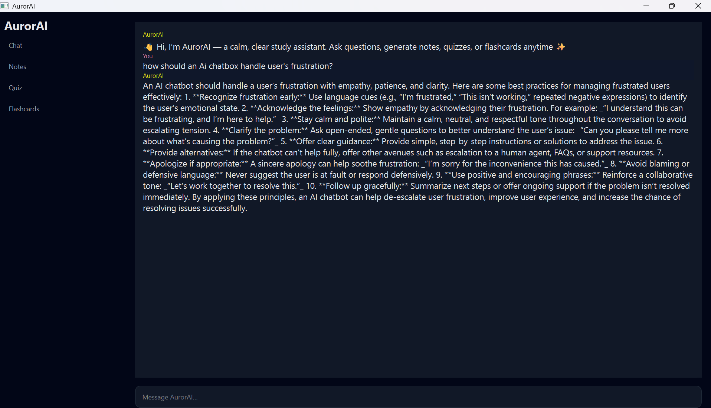

# AurorAI
AurorAI  Your AI-powered study companion with a calming aurora-inspired interface.  AurorAI helps students learn smarter with effective flashcards and note making, interactive quizzes, and personalized AI chat box. Built for focused, engaging, and adaptive study sessions.

AurorAI is a Python-based desktop AI chatbot built using **PyQt6** for the user interface and an **AI API** for intelligent responses.  
It focuses on delivering **clear, structured, and meaningful answers**, including technical explanations and study notes.

This project demonstrates **AI integration, desktop UI development, and prompt-driven response quality**.

---

## Features

- 💬 AI-powered chat interface (desktop application)
- 📚 Generates structured study notes on technical topics
- 🧠 Handles reasoning-based and real-world questions
- 🎨 Clean and responsive PyQt6 UI
- ⚙️ Background threading to keep the UI responsive

---

## 🛠️ Tech Stack

- **Language:** Python  
- **UI Framework:** PyQt6  
- **AI Integration:** OpenAI API  
- **Core Modules:**  
  - `QtWidgets` (UI components)  
  - `QThread` (background processing)  
  - `pyqtSignal` (thread-safe UI updates)  

---

## 🧠 How It Works

1. User enters a prompt in the PyQt6 chat interface  
2. The input is sent to the AI API in a background thread  
3. The AI processes the request and generates a response  
4. The response is displayed in the chat window without freezing the UI  

Special attention is given to **UX, response clarity, and application stability**.

---

## 📸 Screenshots

### AI Handling User Frustration
Shows empathy, reasoning, and proper conversational flow.

### AI-Generated Technical Notes
Demonstrates structured notes on API integration and web concepts.

---

## 📌 Use Cases

- Learning technical concepts
- Generating structured study notes
- Testing AI response quality
- Desktop-based AI assistant demo

---

## 🤖 AI Usage Disclosure

AI tools were used to:
- Assist with content generation
- Improve response structure
- Speed up learning and development

The **application logic, UI design, threading model, and integration decisions** were implemented manually to demonstrate understanding.

---

## 📈 Future Improvements

- Chat history saving
- Theme customization (dark/light)
- Better prompt control
- Packaging as an executable (.exe)

---

## 👤 Author

**Rashika (Riv)**  
Python • PyQt6 • AI Integration  

---

## ⭐ Acknowledgements

Built using Python, PyQt6, and modern AI APIs.
